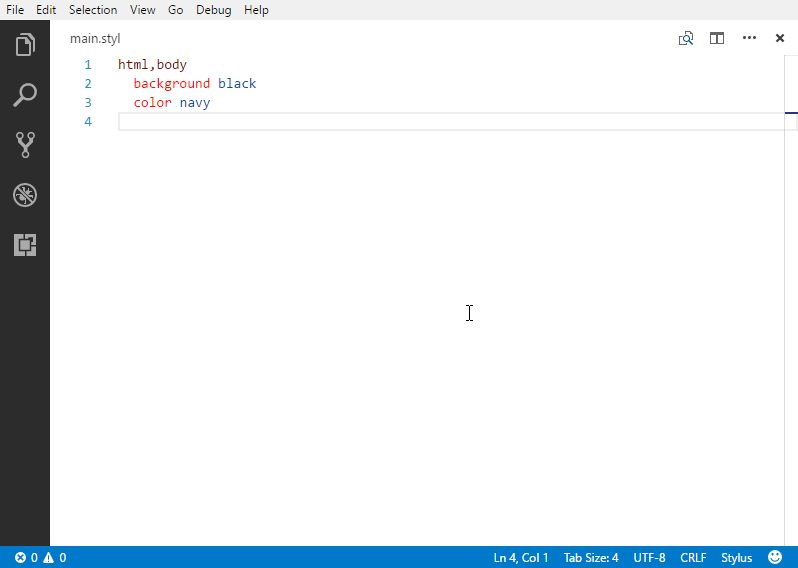
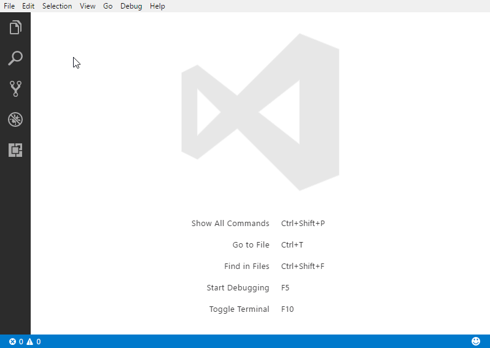

# Stylus Supremacy

**Stylus Supremacy** extension helps formatting *[Stylus](http://stylus-lang.com)* files. It is powered by the [*NPM* package](https://www.npmjs.com/package/stylus-supremacy) with the same name and developed by the same developer.

Once you have this extension installed on your *Visual Studio Code*, you can simply open a *Stylus* file, right click to open the document context menu, then choose **Format Document** or press **Shift+Alt+F** on your keyboard (see `"editor.action.formatDocument"` command in keyboard shortcuts). This also supports **Format Section** command.

## Settings

You can find **Stylus Supremacy** section in the default *Visual Studio Code* settings. There are pretty similar to the [formatting options in the original *NPM* package](https://github.com/ThisIsManta/stylus-supremacy#formatting-options), except that `tabStopChar` and `newLineChar` will be determined automatically based on the current active *Stylus* file.

If you are using *[Stylint](https://www.npmjs.com/package/stylint)* as a *Stylus* linter, the extension will find *.stylintrc* file starting from the current viewing file directory up to your root working directory. However, if both *.stylintrc* file and *Visual Studio Code* settings are found, the *.stylintrc* file will override the *Visual Studio Code* settings.

For more information, please see [*Stylint* compatibility](https://github.com/ThisIsManta/stylus-supremacy#stylint-compatibility) section in the original *NPM* package.

## Release notes

See https://github.com/ThisIsManta/vscode-stylus-supremacy/releases

## Limitations and known issues

- The selection after using **Format Section** command may not accurate.
