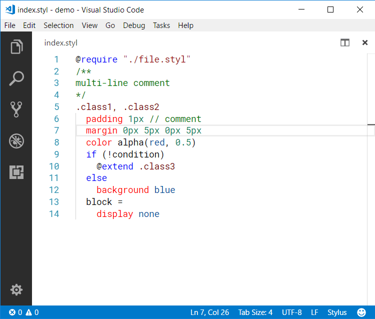

**Stylus Supremacy** extension helps formatting Stylus files. It is powered by the [Node.js module](https://www.npmjs.com/package/stylus-supremacy) with the same name and developed by the same developer.

# Please visit **[our offical website](https://thisismanta.github.io/stylus-supremacy#vscode)** for features and settings.

Related links
- [Stylus language](http://stylus-lang.com)
- [Stylus (Node.js module)](https://www.npmjs.com/package/stylus)
- [Stylus (Visual Studio Code extension)](https://marketplace.visualstudio.com/items?itemName=sysoev.language-stylus)
- [Stylint (Node.js module)](https://www.npmjs.com/package/stylint)
- [Stylint (Visual Studio Code extension)](https://marketplace.visualstudio.com/items?itemName=vtfn.stylint)
- [Stylus Supremacy (Node.js module)](https://www.npmjs.com/package/stylus-supremacy)